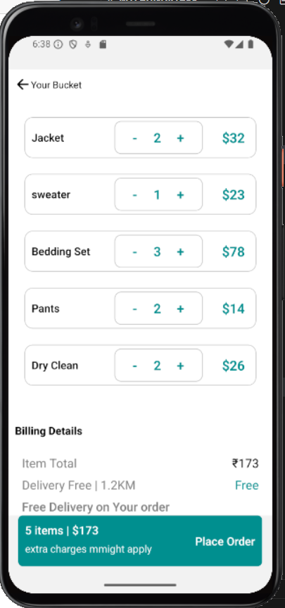

This is a new [**React Native**](https://reactnative.dev) project, bootstrapped using [`@react-native-community/cli`](https://github.com/react-native-community/cli).


# 🧺 Laundry App – React Native

A mobile laundry application built using **React Native CLI**, **Redux Toolkit**, and **Firebase Firestore**. This app allows users to browse clothing items, manage a cart, place laundry orders, and choose a pickup date. User authentication is handled via Firebase.

---

## 🚀 Features

- 🔐 **Login, Signup & Signout** using Firebase Firestore  
- 👕 **Display Clothes** available for laundry  
- 🛒 **Add to Cart / Remove from Cart**  
- 🧾 **Place Order**  
- 📅 **Select Pickup Date**  
- ⚙️ **Redux Toolkit** for state management  
- ☁️ **Firebase Firestore** integration  

---

## 📸 App Screenshots


### 🧾Login Screen


### 🛒 Register Screen


### 👤 Home Screen


### 🧰 Product Detail


### 📅 Add Product in Cart


### 🔐 Select Pickup Date


### 📝 Select Pickup Date


### 🚪 Place Order


### 📦 Place Order


### 🧺 Place Order


### 💬 Order Success


### 🎉 Sign Out


## 🛠️ Getting Started

### 1. Clone the Repository

```bash
git clone https://github.com/PremmChand/MyLaundryApp.git
cd your-repo-name


# Using npm
npm start

# OR using Yarn
yarn start
```

## Step 2: Build and run your app

With Metro running, open a new terminal window/pane from the root of your React Native project, and use one of the following commands to build and run your Android or iOS app:

### Android

```sh
# Using npm
npm run android

# OR using Yarn
yarn android
```

### iOS

For iOS, remember to install CocoaPods dependencies (this only needs to be run on first clone or after updating native deps).

The first time you create a new project, run the Ruby bundler to install CocoaPods itself:

```sh
bundle install
```

Then, and every time you update your native dependencies, run:

```sh
bundle exec pod install
```

For more information, please visit [CocoaPods Getting Started guide](https://guides.cocoapods.org/using/getting-started.html).

```sh
# Using npm
npm run ios

# OR using Yarn
yarn ios
```

Made with ❤️ by [Premm Chand] - Feel free to reach out for contributions or feedback!